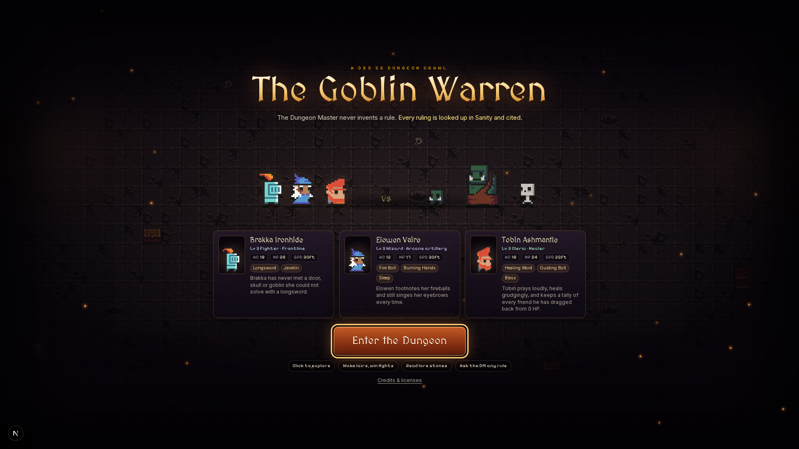
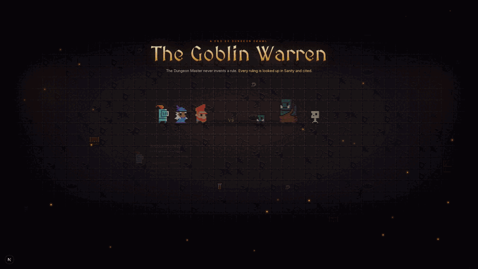

# The Goblin Warren

A browser D&D 5e dungeon crawl with an AI Dungeon Master that never invents a rule. Every ruling is looked up in Sanity and cited.

Built for the DEV x Sanity Challenge (Path 1: an agent on Sanity Context).



## Features

- Lead a fixed party (Fighter, Wizard, Cleric) through five hand-made levels, from The Collapsed Gate to the Throne of the Bugbear Chief.
- Explore with line-of-sight fog of war, a minimap, lairs, traps, chests, gold and lore stones.
- Fight turn-based d20 combat with an initiative rail, a spellbook and 3D dice.
- Ask the AI DM any rules question and get a cited answer. A "How the DM ruled" trace shows every KB search and GROQ query behind it.
- Explore the rules in the Rules Tome graph, and switch between the SRD 2024 and SRD 2014 editions.



## How the DM uses Sanity

There are two Sanity Context MCP endpoints:

| Mode | Endpoint | Used for |
|---|---|---|
| Knowledge Base | `dnd-kb` | Rule prose and 2014 vs 2024 differences |
| GROQ | `dnd-groq` | Exact stats: AC, HP, to-hit, spell dice |

Before the model runs, the server prefetches from both endpoints. The model then gets one optional tool round. Any citation that no lookup returned is dropped. The code is in `src/lib/sanityMcp.ts` and `src/app/api/dm/route.ts`.

If Sanity is not configured, the game falls back to the bundled `data/fallback.json`. If there is no AI key, a template narrator stands in for the model.

## Stack

Next.js 16, React 19, Phaser 4, AI SDK 7 with Baseten (DeepSeek V4.1 Flash), Sanity Studio 6 and Context MCP, Tailwind 4, Vitest and Playwright.

## Getting started

```bash
pnpm install
cp .env.example .env.local   # fill in the values (see below)
pnpm dev                     # http://localhost:3000
```

The game runs without any env vars, using the offline content and narrator.

### Sanity setup

For the full walkthrough, including tokens, the Knowledge Base, the Context endpoints and troubleshooting, see [docs/sanity-setup.md](docs/sanity-setup.md). In short:

1. Create a Sanity project with a private dataset, a Viewer token and an Editor token.
2. Create an org token with the Context Viewer role. The MCP endpoints reject project tokens with `403 contextGrantRequired`.
3. Deploy the schema and seed the content:
   ```bash
   cd studio && pnpm install && pnpm exec sanity schema deploy && cd ..
   pnpm content:build && pnpm sanity:seed
   ```
4. Enable Knowledge Bases in Labs, then create a KB from `rule` and `condition` documents.
5. Create the `dnd-groq` and `dnd-kb` endpoints in the Context app, then add their URLs to `.env.local`.

The seed and content scripts run with Bun.

## Scripts

| Command | What it does |
|---|---|
| `pnpm dev` | Start the dev server |
| `pnpm build` / `pnpm start` | Make a production build and serve it |
| `pnpm test` | Run the Vitest unit tests |
| `pnpm exec playwright test` | Run the e2e tests |
| `pnpm content:build` | Build `data/fallback.json` from the SRD content |
| `pnpm sanity:seed` | Seed the Sanity dataset |

## Credits

All art, music and sound effects are CC0. The rules come from SRD 5.2.1 and 5.1 (CC BY 4.0). See [CREDITS.md](CREDITS.md).
